# MGR Geometry Pack — preview gallery

> Asset IDs and intended use are defined in [`manifest.json`](./manifest.json).  
> Use a single strong mark per panel/slide; background use at 4–8% opacity.

## Marks and world

| Cube / modules | Globe / public world | Globe grid / network | Atom / AI core |
|---|---|---|---|
| 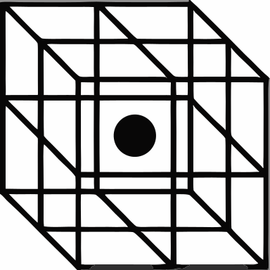 |  |  |  |

## Navigation and flow

| Enter | Outbound | Incoming | Bidirectional |
|---|---|---|---|
|  |  |  |  |

| Vertical | Axis | Scale | Navigation |
|---|---|---|---|
|  | 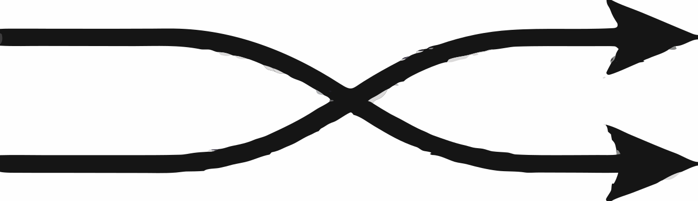 |  |  |

## Objective and focus

| Target | Diamond | Verify | Route decision |
|---|---|---|---|
| 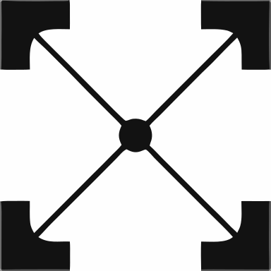 | 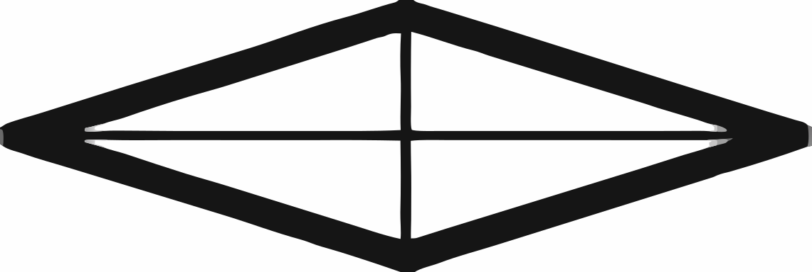 |  | 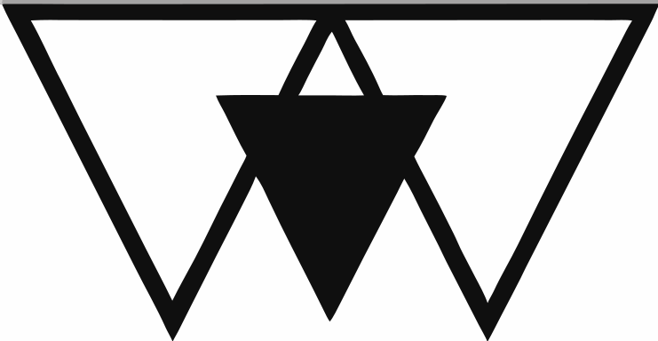 |

## Signals and telemetry

| Alert | Energy | Active | Highlight |
|---|---|---|---|
|  |  | 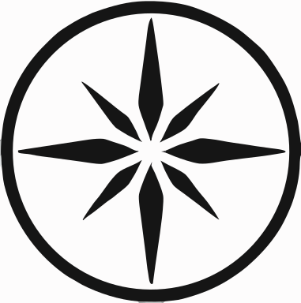 | 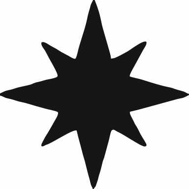 |

| Bars | Circle grid | Horizontal sequence | Vertical sequence |
|---|---|---|---|
| 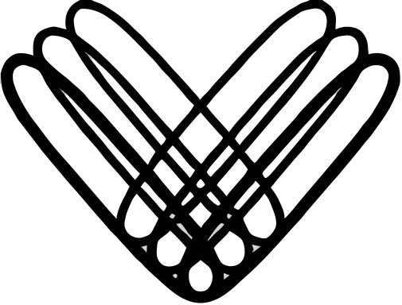 | 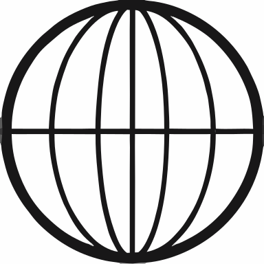 | 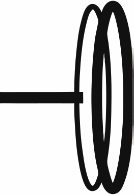 | 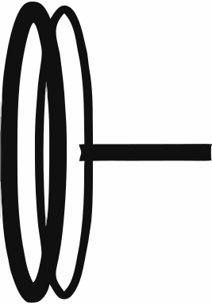 |

## Structural decals

| Interwoven | Radial square | Zigzag band | Triangle arrows |
|---|---|---|---|
|  | 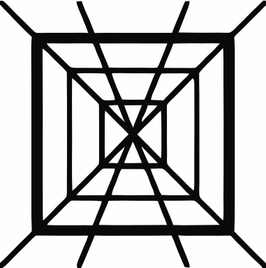 |  | 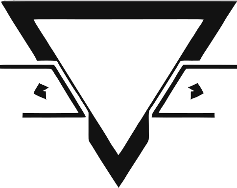 |

`ic-q-logo.svg` is an identity mark. Use it only where its source license and identity context permit.
